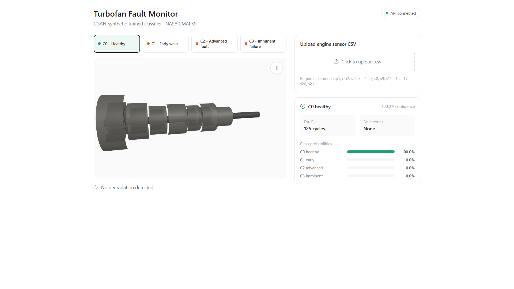

<div align="center">

# 🔧 NASA CMAPSS Turbofan Fault Classification

**Synthetic-data-assisted fault detection for turbofan engines using CGANs + 1D-CNN**

[](https://python.org)
[](https://pytorch.org)
[](https://reactjs.org)
[](https://flask.palletsprojects.com)
[](LICENSE)

**13 Notebooks · 4 CMAPSS Subsets · CGAN Synthetic Augmentation · 3D Fault Visualization**

</div>

---

> Turbofan engines degrade gradually — but rare fault states (imminent failure) are severely underrepresented in sensor data, making standard classifiers blind to the most critical events. This project tackles that gap: physics-derived RUL labels define four fault classes, Conditional GANs generate synthetic minority-class windows to balance training data, and a unified 1D-CNN classifier is trained across all four NASA CMAPSS subsets. A Flask + React dashboard with Three.js 3D visualization serves live inference.

---

## 📸 Demo

<!-- Add screenshot of your React dashboard here -->


> *CSV upload inference + 3D engine fault visualization with per-class probability breakdown*

---

## 🏗️ Pipeline Overview

```
NASA CMAPSS Raw Data (FD001–FD004)
        ↓
  EDA + Data Quality Check          [01_data_quality_and_rul.ipynb]
        ↓
  Preprocessing + Windowing         [02_preprocessing.ipynb]
  (30-cycle windows, 16 features)
        ↓
  Physics-Based RUL Labeling        [03_physics_labels.ipynb]
  (Healthy / Early Wear / Advanced Fault / Imminent Failure)
        ↓
  CGAN Training (per subset)        [05b_training_cgan.ipynb]
        ↓
  Synthetic Fault Generation        [06, 12_synthetic_fault_generation.ipynb]
        ↓
  Unified 1D-CNN Classifier         [13_unified_classifier_colab.ipynb]
        ↓
  Flask API + React Dashboard       [turbofan_app/]
```

---

## 🎯 Fault Classes

| Class | RUL Range | Meaning | Training Challenge |
|-------|-----------|---------|-------------------|
| C0 | > 100 cycles | Healthy | Majority class |
| C1 | 51–100 cycles | Early wear | Moderate |
| C2 | 11–50 cycles | Advanced fault | Minority |
| C3 | 0–10 cycles | Imminent failure | Severe minority — CGAN target |

---

## 📊 Model Results

Unified 1D-CNN classifier trained on CGAN-augmented data across all four subsets:

| Subset | Accuracy | F1 Score | C3 Recall (Imminent Failure) |
|--------|----------|----------|------------------------------|
| FD001 | 0.4800 | 0.479 | 0.57 |
| FD002 | 0.6178 | 0.615 | **0.68** |
| FD003 | 0.4900 | 0.467 | 0.67 |
| FD004 | 0.5403 | 0.531 | 0.57 |

> C3 recall is the critical metric — missing an imminent failure is the highest-cost error.
> CGAN augmentation improved C3 recall by recovering minority-class signal lost due to severe class imbalance.

---

## ✨ Key Technical Contributions

- **Physics-derived labeling** — RUL capped and mapped to four operationally meaningful fault states rather than arbitrary bins
- **Conditional GAN augmentation** — CGANs conditioned on fault class generate realistic synthetic sensor windows for minority classes, replacing SMOTE which ignores temporal structure
- **Unified cross-dataset classifier** — single 1D-CNN trained on all four CMAPSS subsets simultaneously, testing generalization across operating conditions
- **End-to-end deployment** — trained model served via Flask REST API with a React/Vite frontend and Three.js 3D engine visualization

---

## 🛠️ Tech Stack

| Layer | Technology |
|---|---|
| Deep Learning | PyTorch (CGAN + 1D-CNN) |
| Data Processing | NumPy, Pandas, Scikit-learn |
| Visualization | Matplotlib, Plotly, Three.js |
| Backend | Flask, Flask-CORS |
| Frontend | React, Vite, Three.js |
| Training (GPU) | Google Colab (CGAN + classifier phases) |

---

## 🚀 Getting Started

### Prerequisites

- Python 3.10+
- Node.js 18+

### Run the API

```bash
cd turbofan_app/backend
python -m venv .venv

# Windows
.\.venv\Scripts\Activate.ps1

# macOS/Linux
source .venv/bin/activate

pip install -r requirements.txt
python app.py
```

API runs at `http://localhost:5000`

| Endpoint | Method | Description |
|----------|--------|-------------|
| `/api/health` | GET | Health check |
| `/api/classes` | GET | Fault class definitions |
| `/api/predict` | POST | Upload CSV for inference |
| `/api/sample/{0-3}` | GET | Load sample engine data |

### Run the Frontend

```bash
cd turbofan_app/frontend
npm install
npm run dev
```

Open the Vite URL (usually `http://localhost:5173`). Keep Flask running on port `5000`.

---

## 📂 CSV Input Format

Uploaded files must include these 16 sensor columns:

```
op1, op2, s2, s3, s4, s7, s8, s9, s11, s12, s13, s14, s15, s17, s20, s21
```

The backend uses the **last 30 rows** as the inference window. Shorter sequences are zero-padded. Extra columns are ignored. Sample files available in `tests/`.

---

## 📓 Notebook Pipeline

| Notebook | Phase |
|----------|-------|
| `01_data_quality_and_rul.ipynb` | EDA + RUL distribution analysis |
| `02_preprocessing.ipynb` | Windowing, normalization, feature selection |
| `03_physics_labels.ipynb` | RUL → fault class mapping |
| `04_model_architecture.ipynb` | 1D-CNN + CGAN architecture design |
| `05_training.ipynb` | Initial classifier training |
| `05b_training_cgan.ipynb` | CGAN training (per subset) |
| `06_synthetic_fault_generation.ipynb` | Generate + validate synthetic windows |
| `07_validation.ipynb` | MMD + KS statistical validation |
| `08_classifier.ipynb` | Augmented classifier training |
| `09_cross_dataset_eval.ipynb` | Cross-subset generalization eval |
| `10_multi_subset_preprocessing.ipynb` | Unified multi-subset preprocessing |
| `11_multi_subset_cgan_colab.ipynb` | Multi-subset CGAN (Colab, GPU) |
| `12_multi_subset_generation.ipynb` | Unified synthetic generation |
| `13_unified_classifier_colab.ipynb` | Final unified classifier (Colab, GPU) |

---

## 📁 Project Structure

```
nasa-cmapss-synthetic-fault-gen/
├── configs/                        # Pipeline and model configuration
├── notebooks/                      # 13-notebook end-to-end pipeline
├── reports/figures/                # Training, validation, evaluation plots
├── src/                            # Reusable ingestion/preprocessing helpers
├── tests/                          # Sample engine CSV files
├── turbofan_app/
│   ├── backend/                    # Flask inference API
│   └── frontend/                   # React/Vite + Three.js dashboard
├── IMPLEMENTATION.md               # Full pipeline and architecture docs
├── BUGS.md                         # Known limitations and next fixes
└── README.md
```

---

## 📄 Documentation

- `IMPLEMENTATION.md` — full pipeline walkthrough, model architecture, and results analysis
- `BUGS.md` — resolved bugs, known limitations, and recommended next steps

---

## ⚠️ Current Limitations

- Synthetic data validation shows weak KS pass rate despite good MMD scores — distributional mismatch in tail regions
- Demo-friendly fallback scaler used for uploaded windows in local API
- Training uses fixed epoch counts rather than early stopping
- Frontend API URL is hard-coded to `http://localhost:5000/api`

---

## 📄 License

MIT © [Ishaan Nandoskar](https://github.com/ishaannandoskar-05)
